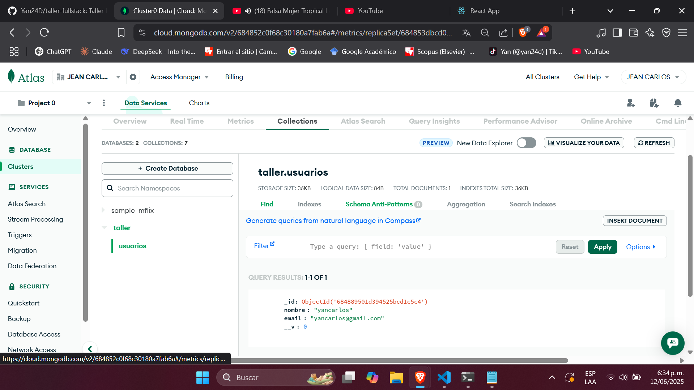
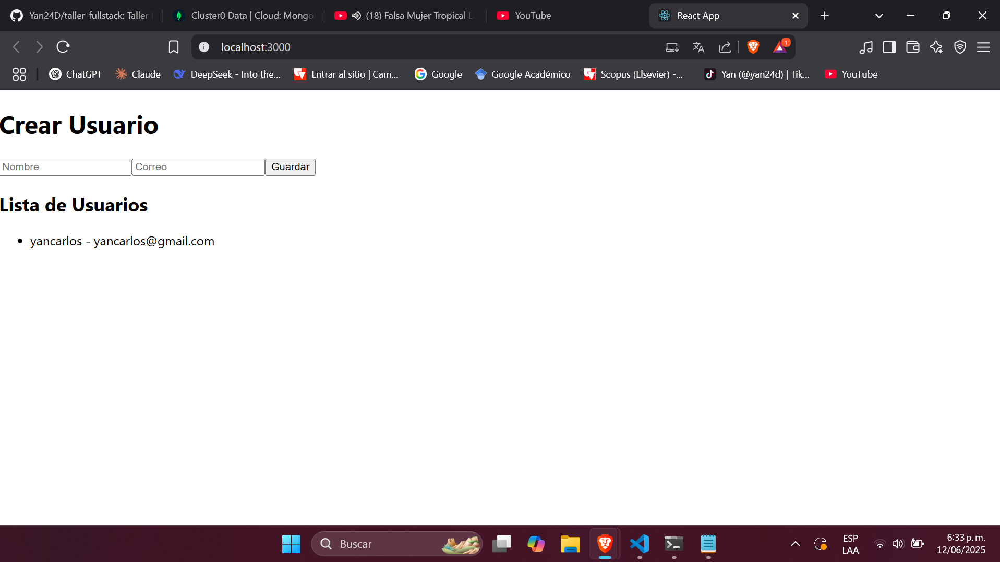
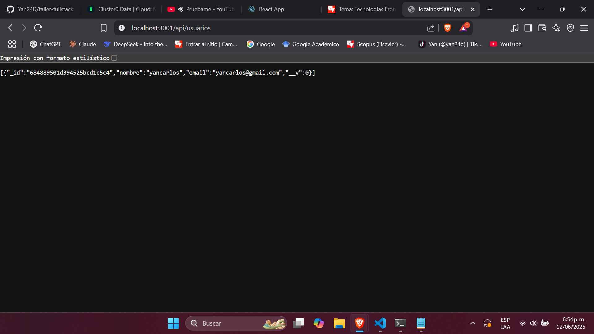

# taller-fullstack
Taller fullstack para proyecto final en desarrollo de software

# 🧩 Taller Fullstack - Desarrollo de Software I

Este proyecto es un laboratorio práctico donde se implementa una **arquitectura full stack completa**, usando React en el frontend, Node.js y Express en el backend, y MongoDB Atlas como base de datos. Permite crear y visualizar usuarios desde una interfaz web conectada a una API.

---

## 🚀 Despliegue en la nube

* 🌐 Frontend: [https://frontend-taller.onrender.com](https://frontend-taller.onrender.com)
* 🛠️ Backend API: [https://backend-taller.onrender.com/api/usuarios](https://backend-taller.onrender.com/api/usuarios)

> ⚠️ Asegúrate de que el backend esté activo antes de probar el frontend, ya que Render puede dormir servicios inactivos.

---

## 📆 Tecnologías usadas

* React (Frontend)
* Node.js + Express (Backend)
* MongoDB Atlas (Base de datos)
* Mongoose (ODM para MongoDB)
* Render (Despliegue en la nube)
* Git y GitHub

---

## 📁 Estructura del repositorio

```
taller-fullstack/
├── frontend/      # Proyecto React (formulario de usuarios)
├── backend/       # API REST (Express + MongoDB)
├── README.md
```

---

## ⚙️ Instalación local

### 🔧 Requisitos

* Node.js y npm instalados
* Cuenta en MongoDB Atlas
* Git

### 1. Clonar el repositorio

```bash
git clone https://github.com/Yan24D/taller-fullstack.git
cd taller-fullstack
```

### 2. Backend (API)

```bash
cd backend
npm install
```

Crea un archivo `.env` dentro de la carpeta `backend/` y agrega tu cadena de conexión:

```env
MONGO_URI=mongodb+srv://<usuario>:<contraseña>@cluster0.xxxxx.mongodb.net/taller?retryWrites=true&w=majority
```

Luego inicia el servidor:

```bash
node server.js
```

### 3. Frontend (React)

```bash
cd ../frontend
npm install
npm start
```

---

## 🧪 Funcionalidades

* Registrar usuarios (nombre y correo)
* Consultar usuarios registrados desde MongoDB
* API REST con rutas GET y POST
* Arquitectura dividida: `frontend/` y `backend/`

---

## 📸 Capturas de pantalla

**
**
**
\\

---

## ✍️ Autores

* **Jean Carlos**
* **Maria Victoria**

Estudiantes de Desarrollo de Software - Proyecto Fullstack 2025
GitHub: [@Yan24D](https://github.com/Yan24D)

---

## 📜 Licencia

Este proyecto fue desarrollado con fines académicos para el curso de *Desarrollo de Software I*.
